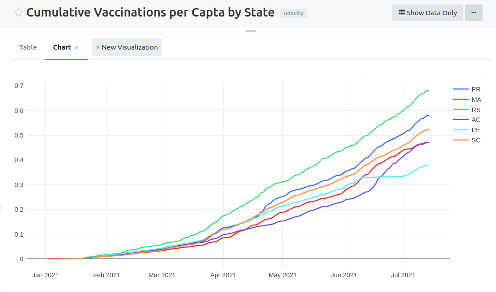
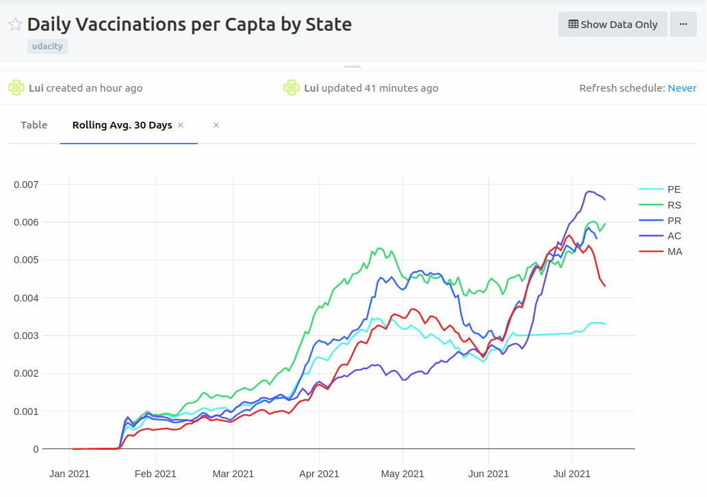
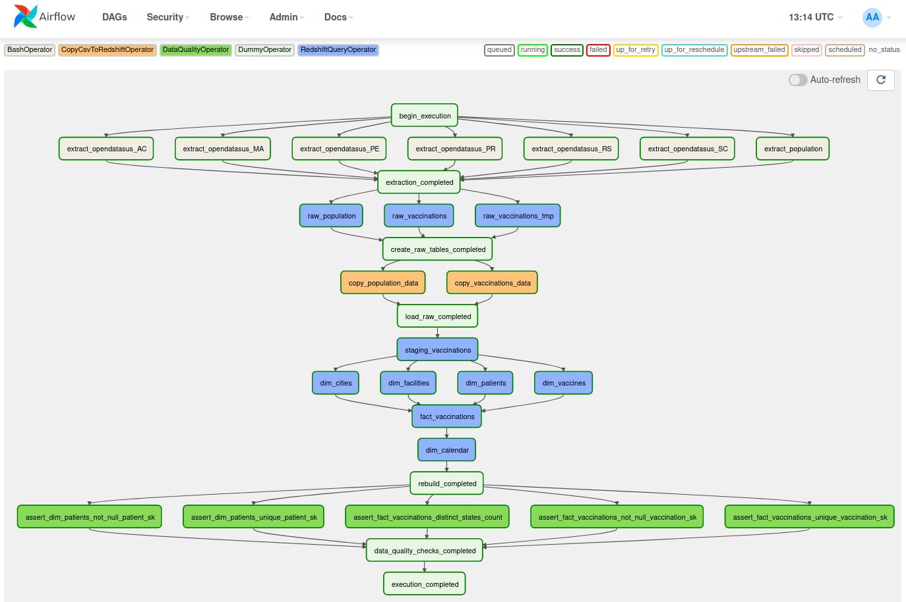
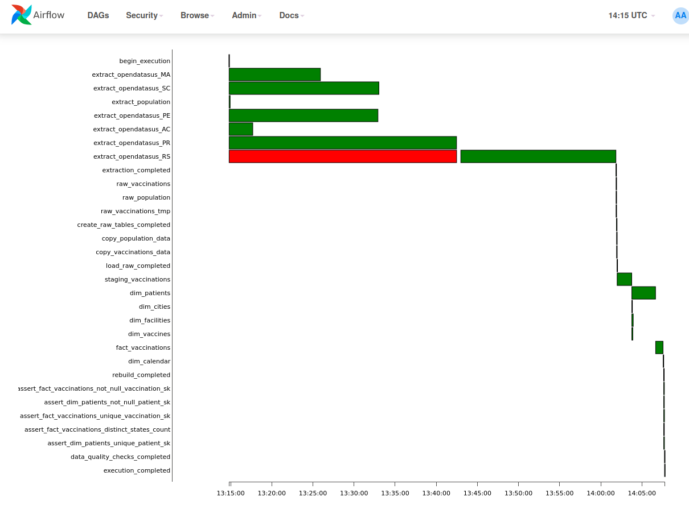

# covid19-vaccination-data-pipeline
Main repository for Udacity Data Engineering Nanodegree Capstone Project - COVID-19 Vaccination in Brazil

## Overview
This project implements an automated data pipeline to ingest and model COVID-19 vaccination data from the Brazilian government.

### Data sources
Two data sources are used:
- [Vaccinations: _Campanha Nacional de Vacinação contra Covid-19_](https://opendatasus.saude.gov.br/dataset/covid-19-vacinacao)
- [Population: 2020 Brazilian census](https://www.ibge.gov.br)

### Data modeling

The output of the pipeline is a dimensional model comprised of one fact table for **vaccinations** and dimensions for **patients**, **facilities**, **vaccines**, **cities**, **cities** and **calendar**.

<details>
  <summary>Expand to all tables with column types </summary>
    
| fact_vaccinations |  |
|---|---|
| vaccination_sk | text |
| patient_sk | text |
| facility_sk | text |
| vaccine_sk | text |
| city_sk | text |
| vaccination_date | timestamptz |
| vaccinations_count | integer |

| dim_patients |  |
|---|---|
| patient_sk | text |
| patient_id | text |
| patient_age | integer |
| patient_birth_date | text |
| patient_biological_gender_enum | text |
| patient_skin_color_code | text |
| patient_skin_color_value | text |
| patient_address_city_ibge_code | text |
| patient_address_city_name | text |
| patient_address_state_abbrev | text |
| patient_address_country_code | text |
| patient_address_country_name | text |
| patient_address_postal_code | text |
| patient_nationality_enum | text |
| vaccination_category_code | text |
| vaccination_category_name | text |
| vaccination_subcategory_code | text |
| vaccination_subcategory_name | text |

| dim_facilities |  |
|---|---|
| facility_sk | text |
| facility_code | text |
| facility_registration_name | text |
| facility_fantasy_name | text |
| facility_city_code | text |
| facility_city_name | text |
| facility_state_abbrev | text |

| dim_vaccines |  |
|---|---|
| vaccine_sk | text |
| vaccination_dose_description | text |
| vaccine_type_code | text |
| vaccine_batch_code | text |
| vaccine_type_name | text |
| vaccine_manufacturer_name | text |
| vaccine_manufacturer_reference_code | text |

| dim_cities |  |
|---|---|
| city_sk | text |
| state | text |
| state_ibge_code | text |
| city_ibge_code | text |
| city | text |
| estimated_population | integer |
| cropped_city_ibge_code | text |

| dim_cities |  |
|---|---|
| city_sk | text |
| state | text |
| state_ibge_code | text |
| city_ibge_code | text |
| city | text |
| estimated_population | integer |
| cropped_city_ibge_code | text |

| dim_calendar |  |
|---|---|
| full_date | timestamptz |
| day | integer |
| week | integer |
| month | integer |
| year | integer |
| weekday | integer |

</details>


This structure enables answering questions such as:

- Which states/cities present the best vaccination per capta ratio?
- How is the vaccination pace evolving over time?
- How many vaccinations are being applied daily in Brazil?
    - Breakdown by state, city, gender, age group, so on
- What vaccines are being applied?
    - Breakdown by manufacturer, type, etc
- How many people are still left to be vaccinated?

#### Example analyses
The charts below were produced using the dimensional model produced by the pipeline.

Q: _Which states present the best vaccination per capta?_


<details>
  <summary>Expand to see query used </summary>


```sql
with state_populations as
(
    -- Pre-aggregate population by state before joining
    select
        state,
        sum(estimated_population) as state_population
    from
        dim_cities
    group by 
        1
),


daily_vaccinations as
(
    select
        dca.full_date as vaccination_date,
        dfa.facility_state_abbrev as state,
        max(pop.state_population) as state_population,
        sum(fva.vaccinations_count) as daily_vaccinations
    from
        fact_vaccinations fva
        inner join
        dim_calendar dca on fva.vaccination_date = dca.full_date
        inner join
        dim_facilities dfa on fva.facility_sk = dfa.facility_sk
        inner join
        state_populations pop on dfa.facility_state_abbrev = pop.state
    where
        dfa.facility_state_abbrev != 'SC'  -- removing due to incomplete data
    group by
        1,2
),

cumulative_daily_vaccinations as
(
    select
        *,
        sum(daily_vaccinations) over (
            partition by state 
            order by vaccination_date 
            rows between unbounded preceding and current row
        )::float as cumulative_daily_vaccinations 
    from
        daily_vaccinations
)

select
    *,
    cumulative_daily_vaccinations / state_population as cumulative_daily_vaccinations_per_capta
from
    cumulative_daily_vaccinations

```
</details>

Q: _How is the vaccination pace evolving over time?_


<details>
  <summary>Expand to see query used </summary>


```sql
with state_populations as
(
    -- Pre-aggregate population by state before joining
    select
        state,
        sum(estimated_population) as state_population
    from
        dim_cities
    group by 
        1
),


daily_vaccinations_per_capta as
(
    select
        dca.full_date as vaccination_date,
        dfa.facility_state_abbrev as state,
        sum(fva.vaccinations_count)::float / max(pop.state_population) as vaccinations_per_capta
    from
        fact_vaccinations fva
        inner join
        dim_calendar dca on fva.vaccination_date = dca.full_date
        inner join
        dim_facilities dfa on fva.facility_sk = dfa.facility_sk
        inner join
        state_populations pop on dfa.facility_state_abbrev = pop.state
    where
        dfa.facility_state_abbrev != 'SC'  -- removing due to incomplete data
    group by
        1,2
)

select
    *,
    avg(vaccinations_per_capta) over (
        partition by state 
        order by vaccination_date 
        rows between 29 preceding and current row
    ) as rolling_avg_30_days 
from
    daily_vaccinations_per_capta


```
</details>


### Pipeline
The data pipeline was automated using Airflow. It is comprised of four major steps:
1. **Extract data from the sources to AWS S3**: this is done using [Singer standard](https://github.com/singer-io/getting-started). The [Open Data SUS tap](https://github.com/lpillmann/tap-opendatasus) was developed from scratch as part of the project. The [S3 CSV target](https://github.com/lpillmann/pipelinewise-target-s3-csv) was adapted from existing one. Airflow `BashOperator` was used to run the tap & target.
1. **Load data from S3 to Redshift**: use of `COPY` statement with custom built operators (`CopyCsvToRedshiftOperator` and `CopyCsvToRedshiftPartionedOperator`).
1. **Transform data into dimensional model**: transformations were done using SQL on top of Redshift, using layers of processing (`raw`, `staging` and `dimensional`) and the custom built operator `RedshiftQueryOperator`.
1. **Data quality checks**: implemented using SQL with custom operator `DataQualityOperator` that compares the test query result with the expected value provided by the user.

Below is the graph view of the DAG:



And here is the Gantt view of a complete execution:



## Setup
### Infrastructure
1. Install local Python env
    ```bash
    make install-infra
    ```

1. Define the following enviroment variables
    ```bash
    # Tip: add this snippet to your bash profile (e.g. ~/.bashrc or ~/.zshrc if you use ZSH)
    export UDACITY_AWS_KEY="..."
    export UDACITY_AWS_SECRET="..."
    export UDACITY_AWS_REGION="..."
    export UDACITY_AWS_PROFILE="..."
    export UDACITY_CAPSTONE_PROJECT_BUCKET="my-bucket"
    export UDACITY_REDSHIFT_HOST="my-host.something-else.redshift.amazonaws.com"
    export UDACITY_REDSHIFT_DB_NAME="..."
    export UDACITY_REDSHIFT_DB_USER="..."
    export UDACITY_REDSHIFT_DB_PASSWORD="..."
    export UDACITY_REDSHIFT_DB_PORT="..."
    export AIRFLOW_UID=1000
    export AIRFLOW_GID=0
    ```

1. Create Redshift cluster
    ```bash
    make create-cluster
    ```

1. Setup Airflow (see respective session)

>When finished using the cluster, remember to delete it to avoid unexpected costs:
>
>Delete Redshift Cluster
>```bash
>make delete-cluster
>```


## Airflow setup
Airflow was configured using Docker following [this reference](https://airflow.apache.org/docs/apache-airflow/stable/start/docker.html#running-airflow).

Build customized image:
```bash
make image
```

Start Airflow services:
```bash
make airflow
```

Open UI at [http://localhost:8080/home](http://localhost:8080/home) using login credentials as user `airflow` and password `airflow`.

> Note 1: this Airflow setup is for development purposes. For production deployment some additional configurations would be needed (see [this reference](https://airflow.apache.org/docs/apache-airflow/stable/production-deployment.html)).

> Note 2: some Airflow environment variables were customized in `docker-compose.yaml`, namely:
>```bash
>AIRFLOW__CORE__LOAD_EXAMPLES: 'false'  # don't load dag examples
>AIRFLOW__WEBSERVER__RELOAD_ON_PLUGIN_CHANGE: 'true'  # reload plugins as soon as they are saved
>AIRFLOW_CONN_REDSHIFT: postgres://...  # custom connection URI using the env vars instead of using UI
>AWS_ACCESS_KEY_ID: ${UDACITY_AWS_KEY}
>AWS_SECRET_ACCESS_KEY: ${UDACITY_AWS_SECRET}
>AWS_DEFAULT_REGION: ${UDACITY_AWS_REGION}
>UDACITY_AWS_PROFILE: ${UDACITY_AWS_PROFILE}
>UDACITY_CAPSTONE_PROJECT_BUCKET: ${UDACITY_CAPSTONE_PROJECT_BUCKET}
>```

## Ad-hoc scripts
### Extract population data
Small CSV is extracted from a public GitHub repository and loaded into the project's S3 bucket.
```
bash dags/scripts/extract/population/run.sh
```

Population estimates by city (2020 census).

> Source: [IBGE](https://www.ibge.gov.br/), data treated and shared by Álvaro Justen/[Brasil.IO](https://brasil.io/)

## Notes and comments
1. Not all Brazilian states are covered. Just a few were selected to use as an example. They amount to over 15 million rows in the fact table.
1. A custom Airflow image was created to enable having a second Python installation on the container. This was needed to run the tap and target without conflicts with Airflow's main one.
1. A partitioned load approach is implemented and can be used in case of daily runs. For development purposes only the load all operator was used since the Redshift cluster was recreated every time. 

### Possible enhancements
These are further improvements that can be made to the project:
- Change incremental extractions to be daily instead of monthly to reduce processing time
- Clean DAG definition by using default arguments more wisely
