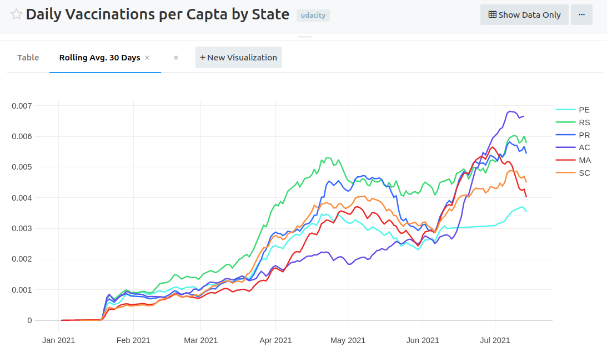
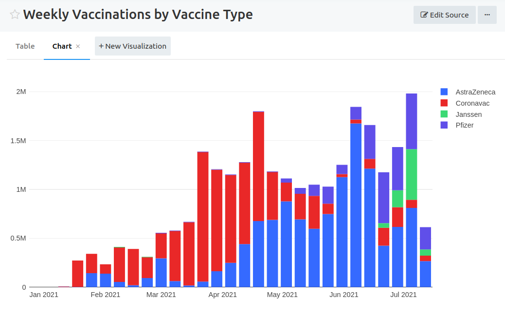
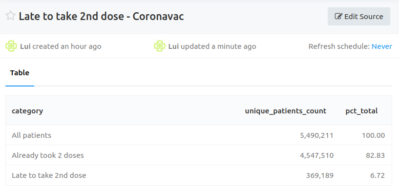

# covid19-vaccination-data-pipeline
Main repository for Udacity Data Engineering Nanodegree Capstone Project - COVID-19 Vaccination in Brazil.

## Overview
This project implements an automated data pipeline to ingest and model vaccination data from the Brazilian government.

### Data sources
Two data sources are used:
- **Vaccinations**: National Covid-19 Vaccination Campaign. Source: Brazilian Ministry of Health. Format: API ([link](https://opendatasus.saude.gov.br/dataset/covid-19-vacinacao)).
- **Population**: 2020 Brazilian census. Source: [IBGE](https://www.ibge.gov.br/), data treated and shared by Álvaro Justen/[Brasil.IO](https://brasil.io/). Format: CSV ([link](https://raw.githubusercontent.com/turicas/covid19-br/master/covid19br/data/populacao-por-municipio-2020.csv)).

### Data modeling

The output of the pipeline is a dimensional model comprised of one fact table for **vaccinations** and dimensions for **patients**, **facilities**, **vaccines**, **cities**, **cities** and **calendar**.

<details>
  <summary>Expand to see the data dictionary for each table </summary>
    
| fact_vaccinations |  |  |
|---|---|---|
| vaccination_sk | text | Unique identifier of the event |
| patient_sk | text | Unique identifier of the patient |
| facility_sk | text | Unique identifier of the facility |
| vaccine_sk | text | Unique identifier of the vaccine |
| city_sk | text | Unique identifier of the city |
| vaccination_date | timestamptz | When the vaccination was applied |
| vaccinations_count | integer | `1` denoting one vaccination per event |

| dim_patients |  |  |
|---|---|---|
| patient_sk | text | Unique identifier of the patient |
| patient_id | text | Unique identifier of the patient (natural key) |
| patient_age | integer | Age of the patient at the time of vaccination |
| patient_birth_date | text | Birth date (some cleaning is needed to covert to date - use age instead) |
| patient_biological_gender_enum | text | Gender acronym |
| patient_skin_color_code | text | Skin color code |
| patient_skin_color_value | text | Skin color description |
| patient_address_city_ibge_code | text | Address city code |
| patient_address_city_name | text | Address city name |
| patient_address_state_abbrev | text | Address state abbreviation |
| patient_address_country_code | text | Address country name |
| patient_address_country_name | text | Address country code |
| patient_address_postal_code | text | Address postal code |
| patient_nationality_enum | text | Nationality acronym |
| vaccination_category_code | text | Vaccination category (elderly, healthcare workers, etc) code |
| vaccination_category_name | text | Vaccination category (elderly, healthcare workers, etc) name |
| vaccination_subcategory_code | text | Vaccination subcategory (age group, type of job, etc) code |
| vaccination_subcategory_name | text | Vaccination subcategory (age group, type of job, etc) name |

| dim_facilities |  |  |
|---|---|---|
| facility_sk | text | Unique identifier of the facility |
| facility_code | text | Unique identifier of the facility (natural key) |
| facility_registration_name | text | Formal registration name ("Razão Social") |
| facility_fantasy_name | text | Fantasy registration name ("Nome Fantasia") |
| facility_city_code | text | City IBGE code |
| facility_city_name | text | City name |
| facility_state_abbrev | text | State abbreviation |

| dim_vaccines |  |  |
|---|---|---|
| vaccine_sk | text | Unique identifier of the vaccine |
| vaccination_dose_description | text | First, second or single dose |
| vaccine_type_code | text | Vaccine type code |
| vaccine_type_name | text | Vaccine type name |
| vaccine_batch_code | text | Vaccine manufacture batch code ("Lote") |
| vaccine_manufacturer_name | text | Vaccine manufacturer name |
| vaccine_manufacturer_reference_code | text | Vaccine manufacturer code |

| dim_cities |  |  |
|---|---|---|
| city_sk | text | Unique identifier of the city |
| state | text | State abbreviation |
| state_ibge_code | text | State IBGE code |
| city_ibge_code | text | City IBGE code (7 digits) |
| city | text | City name |
| estimated_population | integer | Estimated population |
| cropped_city_ibge_code | text | Adjusted city code (6 digits) |

| dim_calendar |  |  |
|---|---|---|
| full_date | timestamptz | Full date |
| day | integer | Day of the month number |
| week | integer | Week of the year number |
| month | integer | Month number |
| year | integer | Year number |
| weekday | integer | Weekday number |

</details>

<br>

This structure enables answering questions such as:

- Which states/cities present the best vaccination per capta?
- How is the vaccination pace evolving over time?
- What types of vaccines are being applied?
- How many people are late to take the second dose?

#### Example analyses
The charts below were built using the dimensional model produced by the pipeline. Below each chart is the query used, for reference.


Q: _Which states present the best vaccination per capta?_


Comment: The state of Rio Grande do Sul (RS) is performing best among the six states evaluated by a significant margin.

<details>
  <summary>Expand to see query used </summary>


```sql
with state_populations as
(
    -- Pre-aggregate population by state before joining
    select
        state,
        sum(estimated_population) as state_population
    from
        dim_cities
    group by 
        1
),


daily_vaccinations as
(
    select
        dca.full_date as vaccination_date,
        dfa.facility_state_abbrev as state,
        max(pop.state_population) as state_population,
        sum(fva.vaccinations_count) as daily_vaccinations
    from
        fact_vaccinations fva
        inner join
        dim_calendar dca on fva.vaccination_date = dca.full_date
        inner join
        dim_facilities dfa on fva.facility_sk = dfa.facility_sk
        inner join
        state_populations pop on dfa.facility_state_abbrev = pop.state
    group by
        1,2
),

cumulative_daily_vaccinations as
(
    select
        *,
        sum(daily_vaccinations) over (
            partition by state 
            order by vaccination_date 
            rows between unbounded preceding and current row
        )::float as cumulative_daily_vaccinations 
    from
        daily_vaccinations
)

select
    *,
    cumulative_daily_vaccinations / state_population as cumulative_daily_vaccinations_per_capta
from
    cumulative_daily_vaccinations

```
</details>


Q: _How is the vaccination pace evolving over time?_

Comment: Almost all six states present the same pattern of reducing the pace of vaccinations in June. This might be related to the vaccine production delays that have impacted the whole country during the period.


<details>
  <summary>Expand to see query used </summary>


```sql
with state_populations as
(
    -- Pre-aggregate population by state before joining
    select
        state,
        sum(estimated_population) as state_population
    from
        dim_cities
    group by 
        1
),


daily_vaccinations_per_capta as
(
    select
        dca.full_date as vaccination_date,
        dfa.facility_state_abbrev as state,
        sum(fva.vaccinations_count)::float / max(pop.state_population) as vaccinations_per_capta
    from
        fact_vaccinations fva
        inner join
        dim_calendar dca on fva.vaccination_date = dca.full_date
        inner join
        dim_facilities dfa on fva.facility_sk = dfa.facility_sk
        inner join
        state_populations pop on dfa.facility_state_abbrev = pop.state
    group by
        1,2
)

select
    *,
    avg(vaccinations_per_capta) over (
        partition by state 
        order by vaccination_date 
        rows between 29 preceding and current row
    ) as rolling_avg_30_days 
from
    daily_vaccinations_per_capta


```
</details>


Q: _What types of vaccines are being applied?_

Comment: Coronavac was the main vaccine from the start up until May. Then, AstraZeneca became the major type being applied. We can observe the growth of Pfizer and Janssen in the most recent months. _Note: Contains only the data from states AC, MA, PE, PR, RS and SC._

<details>
  <summary>Expand to see query used </summary>


```sql
select
    date_trunc('week', dca.full_date) as period,
    
    -- normalize vaccine type
    case
        when lower(dva.vaccine_type_name) like '%butantan%' then 'Coronavac'
        when (lower(dva.vaccine_type_name) like '%astrazeneca%'
              or lower(dva.vaccine_type_name) like '%covishield%') then 'AstraZeneca'
        when lower(dva.vaccine_type_name) like '%pfizer%' then 'Pfizer'
        when lower(dva.vaccine_type_name) like '%janssen%' then 'Janssen'
        else dva.vaccine_type_name
    end as vaccine_type,
    
    sum(fva.vaccinations_count) as total_vaccinations
from
    fact_vaccinations fva
    inner join
    dim_calendar dca on fva.vaccination_date = dca.full_date
    inner join
    dim_vaccines dva on fva.vaccine_sk = dva.vaccine_sk
where
    dva.vaccine_type_name != 'Pendente Identificação'  -- exclude not identified (<1%)
group by
    1,2
```
</details>


Q: _How many people are late to take the second dose?_

Comment: Around 370k patients have taken the first dose but are late to take the second. This represents 6.7% of the total patients who took Coronavac. _Note: Contains only the data from states AC, MA, PE, PR, RS and SC._


<details>
  <summary>Expand to see query used </summary>


```sql
with dim_vaccines_normalized as
(
    select
        *,
         -- normalize vaccine type
        case
            when lower(dva.vaccine_type_name) like '%butantan%' then 'Coronavac'
            when (lower(dva.vaccine_type_name) like '%astrazeneca%'
                  or lower(dva.vaccine_type_name) like '%covishield%') then 'AstraZeneca'
            when lower(dva.vaccine_type_name) like '%pfizer%' then 'Pfizer'
            when lower(dva.vaccine_type_name) like '%janssen%' then 'Janssen'
            else dva.vaccine_type_name
        end as vaccine_normalized_type
    from
        dim_vaccines dva
),

vaccinations_with_weeks_since_column as
(
    select
        fva.*,
        datediff(week, vaccination_date, current_date) as weeks_since_vaccination,
        dva.vaccination_dose_description,
        dva.vaccine_normalized_type
    from
        fact_vaccinations fva
        inner join
        dim_vaccines_normalized dva on fva.vaccine_sk = dva.vaccine_sk
    where
        dva.vaccine_normalized_type = 'Coronavac'
    
),

patients_already_took_two_doses as
(
    select
        patient_sk
    from
        vaccinations_with_weeks_since_column
    group by
        1
    having
        count(*) > 1
),

patients_who_took_only_first_and_are_late_to_take_2nd as
(
    select
        *
    from
        vaccinations_with_weeks_since_column
    where
        weeks_since_vaccination >= 5  -- recommended interval is 4 weeks - tolerance of 1 more
        and
        vaccination_dose_description = '1ª Dose'
        and
        patient_sk not in (select patient_sk from patients_already_took_two_doses)
),

unioned as
(
    select 'All patients' as category, count(distinct patient_sk) as unique_patients_count from vaccinations_with_weeks_since_column
    union all
    select 'Already took 2 doses ', count(distinct patient_sk) from patients_already_took_two_doses
    union all
    select 'Late to take 2nd dose', count(distinct patient_sk) from patients_who_took_only_first_and_are_late_to_take_2nd

),

unioned_with_pct as
(
    select
        *,
        round(100*(unique_patients_count::float / max(unique_patients_count) over ()), 2) as pct_of_total
    from
        unioned
)

select * from unioned_with_pct
order by 1
```
</details>


### Pipeline
Below is the overview of the pipeline:


The data pipeline was automated using Airflow. It is comprised of four major steps:
1. **Extract data from the sources to S3**: for vaccinations API this is done using the [Singer standard](https://www.singer.io/). The [Open Data SUS tap](https://github.com/lpillmann/tap-opendatasus) was developed from scratch as part of the project. The [S3 CSV target](https://github.com/lpillmann/pipelinewise-target-s3-csv) was adapted from existing one. For the population data, a standalone Shell script was used. Airflow `BashOperator` was used to run the extractions.
1. **Load data from S3 to Redshift**: use of `COPY` statement with custom built operators (`CopyCsvToRedshiftOperator` and `CopyCsvToRedshiftPartionedOperator`).
1. **Transform data into dimensional model**: transformations were done using SQL on top of Redshift, using layers of processing (`raw`, `staging` and `dimensional`) and the custom built operator `RedshiftQueryOperator`.
1. **Data quality checks**: implemented using SQL with custom operator `DataQualityOperator` that compares the test query result with the expected value provided by the user.

Below is the graph view of the DAG:


And here is the Gantt view of a complete execution:


## Setup instructions
### Infrastructure
Install local Python env
```bash
make install-infra
```

Define the following enviroment variables
```bash
# Tip: add this snippet to your bash profile (e.g. ~/.bashrc or ~/.zshrc if you use ZSH)
export UDACITY_AWS_KEY="..."
export UDACITY_AWS_SECRET="..."
export UDACITY_AWS_REGION="..."
export UDACITY_AWS_PROFILE="..."
export UDACITY_CAPSTONE_PROJECT_BUCKET="my-bucket"
export UDACITY_REDSHIFT_HOST="my-host.something-else.redshift.amazonaws.com"
export UDACITY_REDSHIFT_DB_NAME="..."
export UDACITY_REDSHIFT_DB_USER="..."
export UDACITY_REDSHIFT_DB_PASSWORD="..."
export UDACITY_REDSHIFT_DB_PORT="..."
export AIRFLOW_UID=1000
export AIRFLOW_GID=0
```

Create Redshift cluster
```bash
make create-cluster
```

>When finished using the cluster, remember to delete it to avoid unexpected costs:
>
>Delete Redshift Cluster
>```bash
>make delete-cluster
>```


### Airflow
Airflow was configured using Docker following [this reference](https://airflow.apache.org/docs/apache-airflow/stable/start/docker.html#running-airflow).

Build customized image:
```bash
make image
```

Start Airflow services:
```bash
make airflow
```

Open UI at [http://localhost:8080/home](http://localhost:8080/home) using login credentials as user `airflow` and password `airflow`.

> Note 1: this Airflow setup is for development purposes. For production deployment some additional configurations would be needed (see [this reference](https://airflow.apache.org/docs/apache-airflow/stable/production-deployment.html)).

> Note 2: some Airflow environment variables were customized in `docker-compose.yaml`, namely:
>```bash
>AIRFLOW__CORE__LOAD_EXAMPLES: 'false'  # don't load dag examples
>AIRFLOW__WEBSERVER__RELOAD_ON_PLUGIN_CHANGE: 'true'  # reload plugins as soon as they are saved
>AIRFLOW_CONN_REDSHIFT: postgres://...  # custom connection URI using the env vars instead of using UI
>AWS_ACCESS_KEY_ID: ${UDACITY_AWS_KEY}
>AWS_SECRET_ACCESS_KEY: ${UDACITY_AWS_SECRET}
>AWS_DEFAULT_REGION: ${UDACITY_AWS_REGION}
>UDACITY_AWS_PROFILE: ${UDACITY_AWS_PROFILE}
>UDACITY_CAPSTONE_PROJECT_BUCKET: ${UDACITY_CAPSTONE_PROJECT_BUCKET}
>```

## Notes
1. Not all Brazilian states are covered. Just a few were selected to use as an example. They amount to over 25 million rows in the fact table which fulfills the Udacity project requirement of 1 million.
1. A custom Airflow image was created to enable having a second Python installation in the container. This was needed to run the tap and target without conflicts with Airflow's main one.
1. Dag was left without schedule, since it was manually triggered during development. The suggested schedule to run in production would be `@daily`.
1. A partitioned load approach by `year_month` and `state_abbrev` is implemented and can be used in case of daily runs. For development purposes only the load all operator was used since the Redshift cluster was recreated every time.
1. The Vaccinations API uses Elasticsearch as engine. The developed tap made use of ES client libraries to enable easier interaction with the endpoints.


### Future work
These are some of the further improvements that can be made to the project:
- Change incremental extractions to be daily instead of monthly to reduce total execution time (currently around 30 minutes)
- Perform further cleaning steps in stage layer to enable easier analysis queries (e.g. normalizing vaccine type names)
- Simplify `DataQualityOperator` usage by providing predefined tests (e.g. uniqueness, not null, etc)
- Clean DAG definition by using default arguments more wisely

## Addressing other scenarios
- **The data was increased by 100x**. The expected impact would be the DAG taking 100x longer to finish, mostly due to the extract step which is the bottleneck. A possible approach to compensate the longer duration would be partitioning and paralelizing the load using some other attribute such as `city`, `day` or `hour` - currently the data is partitioned by `year_month` and `state_abbrev`. The choice of new partitions or incremental criteria would depend on how the data increased (e.g. more events per day? More cities performing vaccinations? More attributes about each event?)
- **The pipelines would be run on a daily basis by 7 am every day**. The DAG is already implemented having a daily schedule in mind. For example, the extraction is done only for the latest `year_month` and the `CopyCsvToRedshiftPartionedOperator` is available to load only a specific partition (it is currenly commented). So the only change would be setting the schedule parameter and uncommenting this operator to be used for the vaccinations data.
- **The database needed to be accessed by 100+ people**. In order to support such demand, Redshift cluster configuration would need to be changed. Specifically, the number of nodes would be increased and, depending on the load, their sizes would need to be increased as well.

## Built with

  - [Airflow](https://airflow.apache.org/) - Pipeline automation and orchestration
  - [AWS Redshift](https://aws.amazon.com/redshift/?whats-new-cards.sort-by=item.additionalFields.postDateTime&whats-new-cards.sort-order=desc) - Used as Data Warehouse
  - [AWS S3](https://aws.amazon.com/s3/) - Staging storage for data sources
  - [Singer](https://www.singer.io/) - Used as the standard to write the extraction systems
  - [boto3](https://boto3.amazonaws.com/v1/documentation/api/latest/index.html) - Used to interact with AWS in infrastructure-as-code scripts
  - [Redash](https://redash.io/) - BI tool used for the charts

## Acknowledgments

This project used AWS credits provided as part of the Udacity Data Engineering Nanodegree course.
